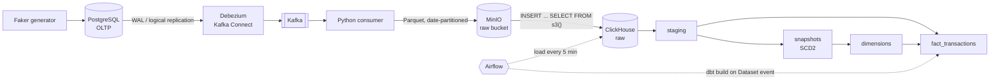
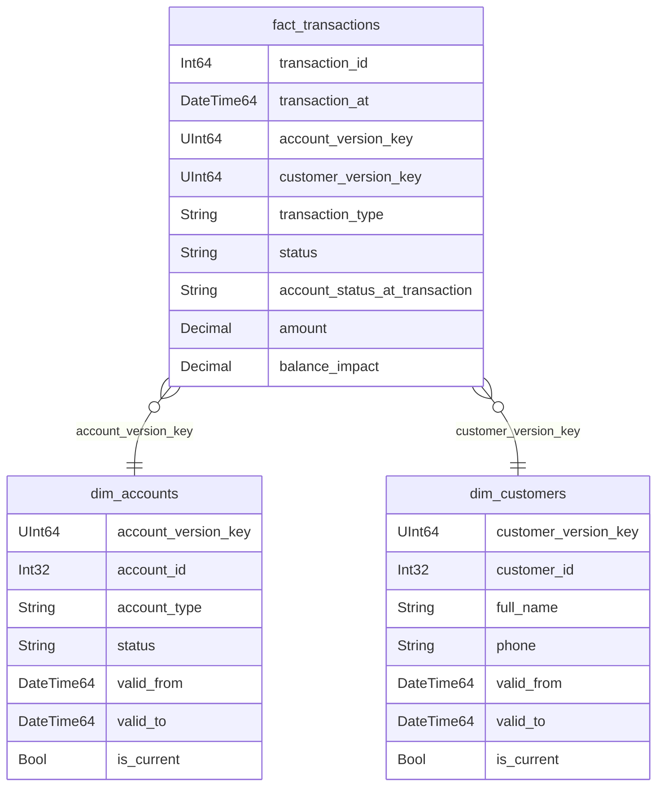

# Banking CDC Data Platform

[](https://github.com/<github-user>/<repo>/actions/workflows/ci.yml)
[](https://github.com/<github-user>/<repo>/actions/workflows/cd.yml)
[](https://<github-user>.github.io/<repo>/)

End-to-end data platform for a simulated bank: every change in the operational PostgreSQL database is captured via **CDC (Debezium + Kafka)**, landed as Parquet in **MinIO**, loaded into **ClickHouse** by **Airflow**, and modeled with **dbt** into a star schema with **SCD Type 2** history. Everything runs locally in Docker; CI tests the dbt logic against an ephemeral ClickHouse with edge-case fixtures, CD publishes the Airflow image and dbt docs.

---

## Architecture



| Layer | Where | What it contains |
|---|---|---|
| Source | PostgreSQL | `customers`, `accounts`, `transactions` (OLTP, constantly updated by the generator) |
| Landing | MinIO `raw/<table>/date=YYYY-MM-DD/*.parquet` | CDC events with metadata (`op`, `lsn`, source timestamp, Kafka offset) |
| Bronze | ClickHouse `raw.*` | Typed event log: one row = one CDC event |
| Silver | ClickHouse `staging.*`, `snapshots.*` | Current state of each entity; SCD2 history of customers and accounts |
| Gold | ClickHouse `marts.*` | Star schema: `dim_customers`, `dim_accounts`, `fact_transactions` |

## Tech stack

| Area | Tools |
|---|---|
| Source database | PostgreSQL 16 (logical replication, `pgoutput`) |
| Change data capture | Debezium 2.7 (Kafka Connect), Apache Kafka 3.7 (KRaft) |
| Object storage | MinIO (S3-compatible), Parquet via PyArrow |
| Warehouse | ClickHouse 24.8 (ReplacingMergeTree, ASOF JOIN, `s3()` table function) |
| Transformations | dbt Core + dbt-clickhouse (snapshots, incremental models, tests, docs) |
| Orchestration | Apache Airflow 2.10 (TaskFlow API, Datasets, pools), Astronomer Cosmos |
| CI/CD | GitHub Actions, GitHub Container Registry, GitHub Pages |
| Infrastructure | Docker Compose |

## Data model



Each transaction references the **versions** of the account and the customer that were valid at the moment of the transaction, so questions like *"what was the account status when this payment happened?"* are answered by a plain join.

Full model documentation with the lineage graph: **[dbt docs](https://<github-user>.github.io/<repo>/)**.

## Key design decisions

### CDC and ingestion
- **The full CDC envelope is kept, not only `after`.** Every row in raw carries `_op`, `_lsn`, `_source_ts` and Kafka partition/offset. Without them it is impossible to order versions correctly or detect deletes; for `d` events the row image is taken from `before`.
- **`REPLICA IDENTITY FULL`** on source tables, so update and delete events contain the full previous row.
- **Money is never a float.** Debezium runs with `decimal.handling.mode=string`, values are cast to `Decimal(18,2)` on load.
- **At-least-once delivery, idempotent storage.** The consumer commits Kafka offsets only after the file is written to MinIO, so an event may be written twice but never lost. Raw tables are `ReplacingMergeTree` keyed by `(_kafka_partition, _kafka_offset)`, which collapses duplicates.
- **Explicit Parquet schemas** in the consumer, so every file of a table has identical column types (otherwise an all-NULL column in one batch breaks reading the whole prefix).
- **ClickHouse reads MinIO directly** via the `s3()` table function; Airflow only orchestrates and never moves data through its workers.
- **File-level load log** (`raw._load_log`). A file is recorded only after a successful insert; a partially failed insert is simply retried, and duplicates are collapsed by the raw engine.

### Modeling
- **Staging picks the latest event by `_lsn`, not by insertion order or `created_at`**, using ClickHouse `LIMIT 1 BY`. Deletes are filtered *after* choosing the latest event — filtering before would "resurrect" deleted rows.
- **Balance is a measure, not an attribute.** The accounts snapshot tracks only `status`, `account_type`, `currency` (`check` strategy); tracking balance would create a new dimension version for almost every transaction. Customers use the `timestamp` strategy on `updated_at`.
- **First version of each entity is valid from its creation time**, not from the first snapshot run — otherwise transactions that happened before the first snapshot have no matching version.
- **Point-in-time lookups via `ASOF JOIN`** — ClickHouse's native way to pick the version with the greatest `valid_from <= transaction_at`.
- **Incremental fact with a 1-hour lookback and `delete+insert`.** In PostgreSQL, ids and timestamps are assigned at insert time but changes reach the WAL at commit time, so a strictly "newer than max" filter can lose rows from concurrent transactions. The lookback reprocesses a small window; `delete+insert` keeps it free of duplicates.

### Orchestration
- **Event-driven dbt runs.** The load DAG emits an Airflow Dataset event once all table loads are done; dbt runs only when new data has actually landed. Tasks with no new files are *skipped*, so no event is emitted.
- **Loads and dbt builds never overlap.** Two interchangeable variants:
  - `minio_to_clickhouse_raw` → `dbt_build_banking`: the whole `dbt build` is one task in a single-slot pool shared with the load tasks.
  - `minio_to_clickhouse_raw_cosmos` → `dbt_cosmos_banking`: Cosmos renders every model/snapshot/test as its own task; the load DAG short-circuits if a dbt run is queued or running. Multi-parent tests (`relationships`, reconciliation) are detached into separate tasks so they are not silently dropped.
- **dbt lives in its own virtualenv inside the Airflow image** to avoid dependency conflicts between Airflow and dbt-core.

### Testing and delivery
- **dbt tests** on keys, accepted values and referential integrity, plus singular tests: exactly one current version per entity, no lost rows in the incremental fact, and a `warn`-severity business rule (no transactions on inactive accounts).
- **CI runs the whole dbt project on an ephemeral ClickHouse** with hand-crafted fixtures covering duplicates, deletes, out-of-order events, NULLs, SCD2 changes between two runs, ASOF point-in-time matching and the incremental path — and asserts exact expected values.
- **CD** builds the Airflow image with DAGs and the dbt project baked in, verifies that all DAGs import inside the image, and publishes it to GHCR tagged with `latest` and the commit SHA. dbt docs are published to GitHub Pages.

## Known limitations

- **dbt snapshots only see the state at run time.** If an attribute changes and changes back between two runs, the intermediate version is lost. Running dbt after every load narrows the window; since the raw layer holds the full event log, SCD2 could instead be built directly from CDC events with exact timestamps.
- **History before the connector was created is not available** — the initial Debezium snapshot captures only the state at that moment.
- **Referential integrity across tables is eventually consistent**: each table is a separate topic and file stream.
- **MinIO credentials are passed inline to `s3()`**; ClickHouse named collections would be the production approach.
- **Single-node, single-partition setup**; Airflow runs scheduler and webserver in one container with `LocalExecutor`.
- The load DAG checks running dbt DAGs via `DagRun.find`, which relies on direct metadata DB access available in Airflow 2 (Airflow 3 would use the REST API).

## Project structure

```
.
├── .github/workflows/
│   ├── ci.yml                     # ruff + dbt build on ephemeral ClickHouse with fixtures
│   └── cd.yml                     # Airflow image → GHCR, dbt docs → GitHub Pages
├── airflow/
│   ├── Dockerfile                 # Airflow + Cosmos, dbt in a separate venv
│   ├── requirements.txt
│   └── dags/
│       ├── minio_to_clickhouse.py         # load MinIO → ClickHouse raw (BashOperator pipeline)
│       ├── minio_to_clickhouse_cosmos.py  # same, with dbt-running guard (Cosmos pipeline)
│       ├── dbt_build.py                   # dbt build as a single task
│       └── dbt_cosmos.py                  # dbt project rendered by Cosmos
├── banking_dbt/
│   ├── models/
│   │   ├── staging/               # latest state from the CDC event log
│   │   └── marts/                 # dimensions and facts
│   ├── snapshots/                 # SCD2 for customers and accounts
│   ├── tests/                     # singular tests (+ tests/ci: fixture assertions)
│   ├── macros/
│   ├── dbt_project.yml
│   └── profiles.yml               # credentials via env_var()
├── ci/
│   ├── fixtures/                  # raw CDC events for CI (two phases)
│   └── check_dags.py              # DAG import check inside the built image
├── clickhouse/init/               # raw tables and load log DDL
├── consumer/kafka_to_minio.py     # Kafka → Parquet in MinIO
├── data/data_generator.py
├── kafka-debezium/generate_and_post_connector.py
├── postgres/schema.sql
├── docker-compose.yml
└── .env.example
```

## Quick start

**Requirements:** Docker with Docker Compose, Python 3.11.

```bash
# 1. Configuration
cp .env.example .env            # adjust passwords if needed
python -m venv .venv
source .venv/bin/activate       # Windows: .venv\Scripts\activate
pip install -r requirements.txt

# 2. Infrastructure (Postgres, Kafka, Debezium, MinIO, ClickHouse, Airflow)
docker compose up -d

# 3. Register the Debezium connector
python kafka-debezium/generate_and_post_connector.py

# 4. Start the consumer (keep it running in a separate terminal)
python consumer/kafka_to_minio.py

# 5. Generate data (loops every few seconds; use --once for a single batch)
python data/data_generator.py
```

Then open Airflow at http://localhost:8080 (`admin` / `admin`) and unpause **one** of the pipelines:

- `minio_to_clickhouse_raw` + `dbt_build_banking`, or
- `minio_to_clickhouse_raw_cosmos` + `dbt_cosmos_banking`.

Within a few minutes changes from PostgreSQL appear in `marts.*` in ClickHouse.

### Local services

| Service | URL / port |
|---|---|
| Airflow | http://localhost:8080 |
| Kafka UI | http://localhost:8085 |
| MinIO console | http://localhost:9001 |
| Kafka Connect REST | http://localhost:8083 |
| ClickHouse HTTP | localhost:8123 |
| PostgreSQL | localhost:5432 |
| Kafka (from host) | localhost:29092 |

### Running dbt locally

```bash
cd banking_dbt
dbt build                        # snapshots, models, tests
dbt docs generate && dbt docs serve --port 8081
```

Pause the dbt DAG in Airflow while running dbt locally, so that two processes do not write snapshots at the same time.

## Example queries

```sql
-- Account status at the time of each transaction vs. current status
SELECT
    f.transaction_id,
    f.transaction_at,
    f.account_status_at_transaction,
    d.status AS current_status
FROM marts.fact_transactions f
JOIN marts.dim_accounts d
    ON f.account_id = d.account_id AND d.is_current
WHERE f.account_status_at_transaction != d.status;

-- Daily turnover by transaction type
SELECT
    transaction_date,
    transaction_type,
    countIf(status = 'completed') AS completed,
    countIf(status = 'failed')    AS failed,
    sum(balance_impact)           AS net_balance_impact
FROM marts.fact_transactions
GROUP BY transaction_date, transaction_type
ORDER BY transaction_date, transaction_type;
```
