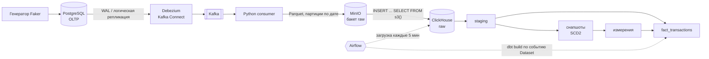
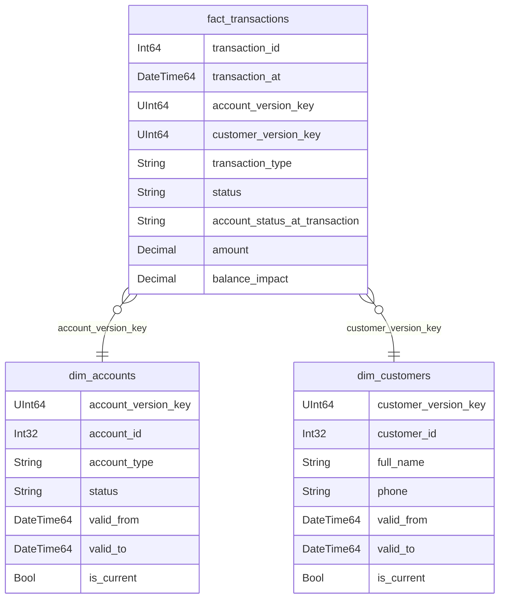

# Banking CDC Data Platform

[English](README.md) | **Русский**

[](https://github.com/SavchukDI/banking_dwh/actions/workflows/ci.yml)
[](https://github.com/SavchukDI/banking_dwh/actions/workflows/cd.yml)
[](https://savchukdi.github.io/banking_dwh/)

Сквозная платформа данных для модели банка: каждое изменение в операционной базе PostgreSQL захватывается через **CDC (Debezium + Kafka)**, сохраняется в Parquet в **MinIO**, загружается в **ClickHouse** с помощью **Airflow** и моделируется в **dbt** в схему «звезда» с историей **SCD Type 2**. Всё работает локально в Docker. CI проверяет логику dbt на временном ClickHouse с тестовыми данными, покрывающими граничные случаи, а CD публикует образ Airflow и документацию dbt.

---

## Архитектура



| Слой | Где | Что содержит |
|---|---|---|
| Источник | PostgreSQL | `customers`, `accounts`, `transactions` (OLTP, генератор постоянно их меняет) |
| Приёмник | MinIO `raw/<table>/date=YYYY-MM-DD/*.parquet` | CDC-события с метаданными (`op`, `lsn`, время в источнике, offset Kafka) |
| Bronze | ClickHouse `raw.*` | Типизированный журнал событий: одна строка = одно CDC-событие |
| Silver | ClickHouse `staging.*`, `snapshots.*` | Актуальное состояние сущностей; SCD2-история клиентов и счетов |
| Gold | ClickHouse `marts.*` | Схема «звезда»: `dim_customers`, `dim_accounts`, `fact_transactions` |

## Стек технологий

| Область | Инструменты |
|---|---|
| База-источник | PostgreSQL 16 (логическая репликация, `pgoutput`) |
| Захват изменений | Debezium 2.7 (Kafka Connect), Apache Kafka 3.7 (KRaft) |
| Объектное хранилище | MinIO (S3-совместимое), Parquet через PyArrow |
| Хранилище данных | ClickHouse 24.8 (ReplacingMergeTree, ASOF JOIN, табличная функция `s3()`) |
| Трансформации | dbt Core + dbt-clickhouse (снапшоты, инкрементальные модели, тесты, документация) |
| Оркестрация | Apache Airflow 2.10 (TaskFlow API, Datasets, пулы), Astronomer Cosmos |
| CI/CD | GitHub Actions, GitHub Container Registry, GitHub Pages |
| Инфраструктура | Docker Compose |

## Модель данных



Каждая транзакция ссылается на **версии** счёта и клиента, которые действовали в момент транзакции. Поэтому на вопросы вроде *«какой статус был у счёта, когда прошёл этот платёж?»* отвечает обычный JOIN.

Полная документация моделей с графом зависимостей: **[dbt docs](https://savchukdi.github.io/banking_dwh/)**.

## Ключевые проектные решения

### CDC и загрузка
- **Сохраняется всё CDC-событие, а не только `after`.** Каждая строка в raw содержит `_op`, `_lsn`, `_source_ts` и partition/offset Kafka. Без них невозможно правильно упорядочить версии строки и обнаружить удаления. У событий `d` данные строки берутся из `before`.
- **`REPLICA IDENTITY FULL`** на таблицах источника, чтобы события обновления и удаления содержали предыдущее состояние строки целиком.
- **Деньги никогда не хранятся во float.** Debezium работает с `decimal.handling.mode=string`, при загрузке значения приводятся к `Decimal(18,2)`.
- **Доставка at-least-once, идемпотентное хранение.** Consumer коммитит offset'ы Kafka только после записи файла в MinIO: событие может записаться дважды, но не потеряется. Raw-таблицы — `ReplacingMergeTree` с ключом `(_kafka_partition, _kafka_offset)`, который схлопывает дубли.
- **Явные схемы Parquet** в consumer'е: все файлы одной таблицы имеют одинаковые типы колонок. Иначе колонка, целиком состоящая из NULL в одной пачке, ломает чтение всех файлов таблицы.
- **ClickHouse читает MinIO напрямую** через табличную функцию `s3()`. Airflow только оркестрирует и не пропускает данные через свои воркеры.
- **Журнал загрузки на уровне файлов** (`raw._load_log`). Файл отмечается только после успешной вставки. Частично упавшая вставка просто повторяется, а дубли схлопывает движок raw-таблицы.

### Моделирование
- **Staging выбирает последнее событие по `_lsn`, а не по порядку вставки или `created_at`**, через `LIMIT 1 BY` в ClickHouse. Удаления отфильтровываются *после* выбора последнего события: если фильтровать раньше, удалённые строки «воскресают».
- **Баланс — это показатель, а не атрибут.** Снапшот счетов отслеживает только `status`, `account_type`, `currency` (стратегия `check`). Если отслеживать баланс, почти каждая транзакция создавала бы новую версию измерения. Клиенты используют стратегию `timestamp` по `updated_at`.
- **Первая версия каждой сущности действует с момента её создания**, а не с первого запуска снапшота. Иначе у транзакций, прошедших до первого снапшота, не нашлось бы подходящей версии.
- **Поиск версии на момент транзакции через `ASOF JOIN`** — встроенный в ClickHouse способ выбрать версию с наибольшим `valid_from <= transaction_at`.
- **Инкрементальная таблица фактов с окном в 1 час и `delete+insert`.** В PostgreSQL id и время назначаются при вставке, а в WAL изменение попадает при коммите. Поэтому фильтр «строго новее максимума» может терять строки из параллельных транзакций. Окно заново обрабатывает небольшой интервал, а `delete+insert` не допускает дублей.

### Оркестрация
- **Событийный запуск dbt.** DAG загрузки отправляет событие Airflow Dataset один раз, после загрузки всех таблиц. dbt запускается только когда действительно пришли новые данные. Задачи без новых файлов получают статус *skipped* и событие не отправляют.
- **Загрузка и сборка dbt никогда не пересекаются.** Два взаимозаменяемых варианта:
  - `minio_to_clickhouse_raw` → `dbt_build_banking`: весь `dbt build` — одна задача в пуле с одним слотом, общем с задачами загрузки.
  - `minio_to_clickhouse_raw_cosmos` → `dbt_cosmos_banking`: Cosmos превращает каждую модель, снапшот и тест в отдельную задачу, а DAG загрузки пропускает запуск, если dbt в очереди или выполняется. Тесты с несколькими родителями (`relationships`, сверка полноты) выделены в отдельные задачи, чтобы Cosmos не отбросил их молча.
- **dbt установлен в отдельный virtualenv внутри образа Airflow**, чтобы избежать конфликтов зависимостей между Airflow и dbt-core.

### Тестирование и поставка
- **Тесты dbt** на ключи, допустимые значения и ссылочную целостность, плюс singular-тесты: ровно одна актуальная версия у каждой сущности, отсутствие потерь в инкрементальной таблице фактов и бизнес-правило с уровнем `warn` (нет транзакций по неактивным счетам).
- **CI прогоняет весь проект dbt на временном ClickHouse** с вручную составленными тестовыми данными. Они покрывают дубли, удаления, события не по порядку, NULL, изменения SCD2 между двумя запусками, поиск версий через ASOF JOIN и инкрементальную ветку, а тесты сверяют точные ожидаемые значения.
- **CD** собирает образ Airflow с DAG'ами и проектом dbt внутри, проверяет, что все DAG'и импортируются в образе, и публикует его в GHCR с тегами `latest` и SHA коммита. Документация dbt публикуется на GitHub Pages.

## Известные ограничения

- **Снапшоты dbt видят только состояние на момент запуска.** Если атрибут изменился и вернулся обратно между двумя запусками, промежуточная версия теряется. Запуск dbt после каждой загрузки сужает это окно. Поскольку в raw хранится полный журнал событий, SCD2 можно строить прямо из CDC-событий с точными временами изменений.
- **История до создания коннектора недоступна:** начальный снапшот Debezium фиксирует только состояние на тот момент.
- **Ссылочная целостность между таблицами обеспечивается в конечном счёте (eventual consistency):** каждая таблица — отдельный топик и отдельный поток файлов.
- **Учётные данные MinIO передаются прямо в `s3()`**; в продакшене использовались бы named collections ClickHouse.
- **Одна нода и одна партиция;** scheduler и webserver Airflow работают в одном контейнере с `LocalExecutor`.
- DAG загрузки проверяет запущенные DAG'и dbt через `DagRun.find`. Это прямой доступ к базе метаданных, который есть в Airflow 2; в Airflow 3 для этого используется REST API.

## Структура проекта

```
.
├── .github/workflows/
│   ├── ci.yml                     # ruff + dbt build на временном ClickHouse с тестовыми данными
│   └── cd.yml                     # образ Airflow → GHCR, dbt docs → GitHub Pages
├── airflow/
│   ├── Dockerfile                 # Airflow + Cosmos, dbt в отдельном venv
│   ├── requirements.txt
│   └── dags/
│       ├── minio_to_clickhouse.py         # загрузка MinIO → ClickHouse raw (вариант с BashOperator)
│       ├── minio_to_clickhouse_cosmos.py  # то же + проверка, что dbt не запущен (вариант с Cosmos)
│       ├── dbt_build.py                   # dbt build одной задачей
│       └── dbt_cosmos.py                  # проект dbt, развёрнутый Cosmos в задачи
├── banking_dbt/
│   ├── models/
│   │   ├── staging/               # актуальное состояние из журнала CDC-событий
│   │   └── marts/                 # измерения и факты
│   ├── snapshots/                 # SCD2 для клиентов и счетов
│   ├── tests/                     # singular-тесты (+ tests/ci: проверки на тестовых данных)
│   ├── macros/
│   ├── dbt_project.yml
│   └── profiles.yml               # учётные данные через env_var()
├── ci/
│   ├── fixtures/                  # CDC-события для CI (две фазы)
│   └── check_dags.py              # проверка импорта DAG'ов в собранном образе
├── clickhouse/init/               # DDL raw-таблиц и журнала загрузки
├── consumer/kafka_to_minio.py     # Kafka → Parquet в MinIO
├── data/data_generator.py
├── kafka-debezium/generate_and_post_connector.py
├── postgres/schema.sql
├── docker-compose.yml
└── .env.example
```

## Быстрый старт

**Требования:** Docker с Docker Compose, Python 3.14.7.

```bash
# 1. Настройка
cp .env.example .env            # при необходимости поменяйте пароли
python -m venv .venv
source .venv/bin/activate       # Windows: .venv\Scripts\activate
pip install -r requirements.txt

# 2. Инфраструктура (Postgres, Kafka, Debezium, MinIO, ClickHouse, Airflow)
docker compose up -d

# 3. Регистрация коннектора Debezium
python kafka-debezium/generate_and_post_connector.py

# 4. Запуск consumer'а (оставьте работать в отдельном терминале)
python consumer/kafka_to_minio.py

# 5. Генерация данных (цикл каждые несколько секунд; --once — одна порция)
python data/data_generator.py
```

Затем откройте Airflow по адресу http://localhost:8080 (`admin` / `admin`) и включите **одну** из связок:

- `minio_to_clickhouse_raw` + `dbt_build_banking`, или
- `minio_to_clickhouse_raw_cosmos` + `dbt_cosmos_banking`.

Через несколько минут изменения из PostgreSQL появятся в `marts.*` в ClickHouse.

### Локальные сервисы

| Сервис | Адрес / порт |
|---|---|
| Airflow | http://localhost:8080 |
| Kafka UI | http://localhost:8085 |
| Консоль MinIO | http://localhost:9001 |
| Kafka Connect REST | http://localhost:8083 |
| ClickHouse HTTP | localhost:8123 |
| PostgreSQL | localhost:5432 |
| Kafka (с хоста) | localhost:29092 |

### Локальный запуск dbt

```bash
cd banking_dbt
dbt build                        # снапшоты, модели, тесты
dbt docs generate && dbt docs serve --port 8081
```

На время локального запуска dbt поставьте DAG dbt в Airflow на паузу, чтобы два процесса не писали снапшоты одновременно.

## Примеры запросов

```sql
-- Статус счёта на момент транзакции и текущий статус
SELECT
    f.transaction_id,
    f.transaction_at,
    f.account_status_at_transaction,
    d.status AS current_status
FROM marts.fact_transactions f
JOIN marts.dim_accounts d
    ON f.account_id = d.account_id AND d.is_current
WHERE f.account_status_at_transaction != d.status;

-- Дневной оборот по типам транзакций
SELECT
    transaction_date,
    transaction_type,
    countIf(status = 'completed') AS completed,
    countIf(status = 'failed')    AS failed,
    sum(balance_impact)           AS net_balance_impact
FROM marts.fact_transactions
GROUP BY transaction_date, transaction_type
ORDER BY transaction_date, transaction_type;
```
